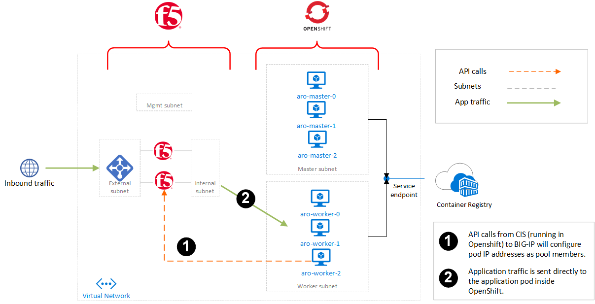

# azure-redhat-openshift-f5

## Pre-requisites
1. **You will need a Service Principal (SP) in AzureAD with a secret. This SP will require Contributor permissions on the Resource Group into which you deploy.** In practice, this means either create a Resource Group prior to deploying into it, and give a SP Contributor rights, or, use a SP with Contributor rights over the subscription.

## Instructions
Instructions for deploying this demo environment with F5 via ARM template are below:
1. Deploy ARM template by clicking the Deploy button below.  

    
  
2. **Create or edit a public DNS record** so that the Custom DNS Record you entered into the deployment points to the IP address value in the output called `publicExternalLoadBalancerAddress`.
3. Optionally, further configure F5 and OpenShift environment by accessing the environment via the URL's in the deployment outputs.

Alternatively, for the official instructions from Microsoft on deploying ARO, you can view [this tutorial](https://docs.microsoft.com/en-us/azure/openshift/tutorial-create-cluster). These instructions are intended to be run from a Linux workstation with [az cli](https://docs.microsoft.com/en-us/cli/azure/install-azure-cli) installed. However, following these instructions will not create the architecture pictured below, which is the intention of this ARM deployment above.

## Architecture

## Pledge for Racial Equality, Diversity, and Inclusion
I do not represent F5 and the code in this repo is my own, but I do work for F5. F5 has [pledged](https://www.f5.com/company/blog/our-pledge-for-racial-equality--diversity--and-inclusion) to fight against racism, and I have joined that pledge. Part of this effort includes updating our code and documentation to discontinue the use of terms that may be considered racially charged.  
  
To that end, this repo has removed, where possible, words such as "master" and "blacklist" and replaced them with "main" (eg, the default git branch), or "primary" (eg, the subnet name), or "denylist" (not used in this repo at the time of this writing). If you see any terms considered racially charged, please submit an issue to bring it to attention. This effort is expected to be on-going and faces some challenges (eg, hardcoded protocol terms) but over time the intent is to remove all terms that are considered racially charged. Thank you for any help in this regard.

## Support and Issues
This repo is hosted in a personal account, and this solution is not an officially supported solution. However, please [submit an issue](https://github.com/mikeoleary/azure-redhat-openshift-f5/issues) if you find a problem or have a question. Thanks for any co-operation and support.
